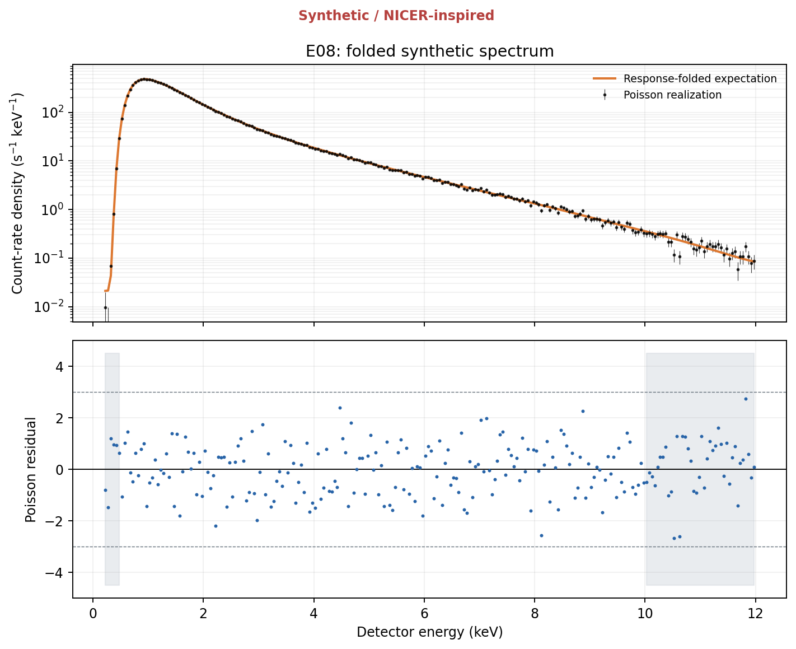
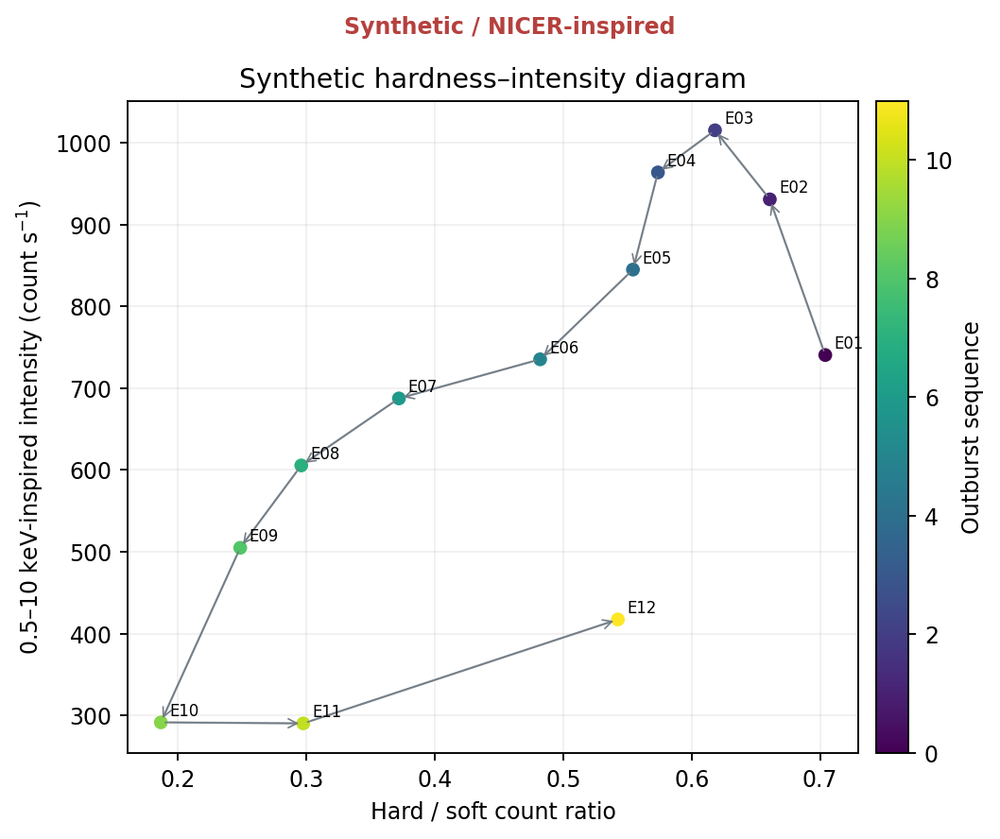
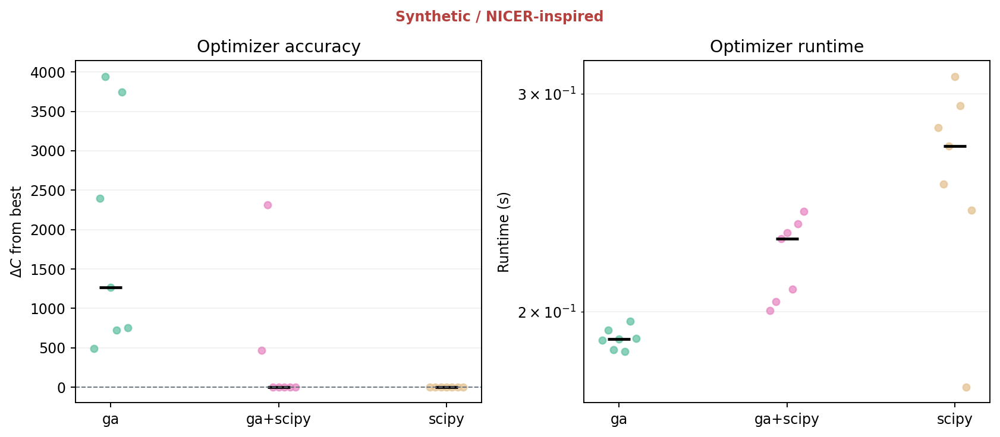
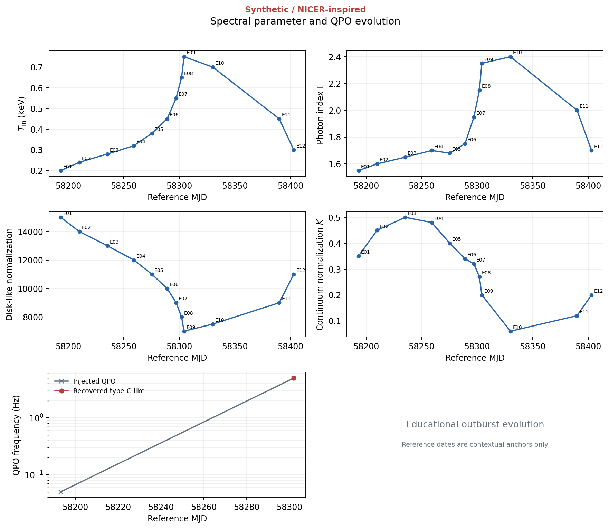
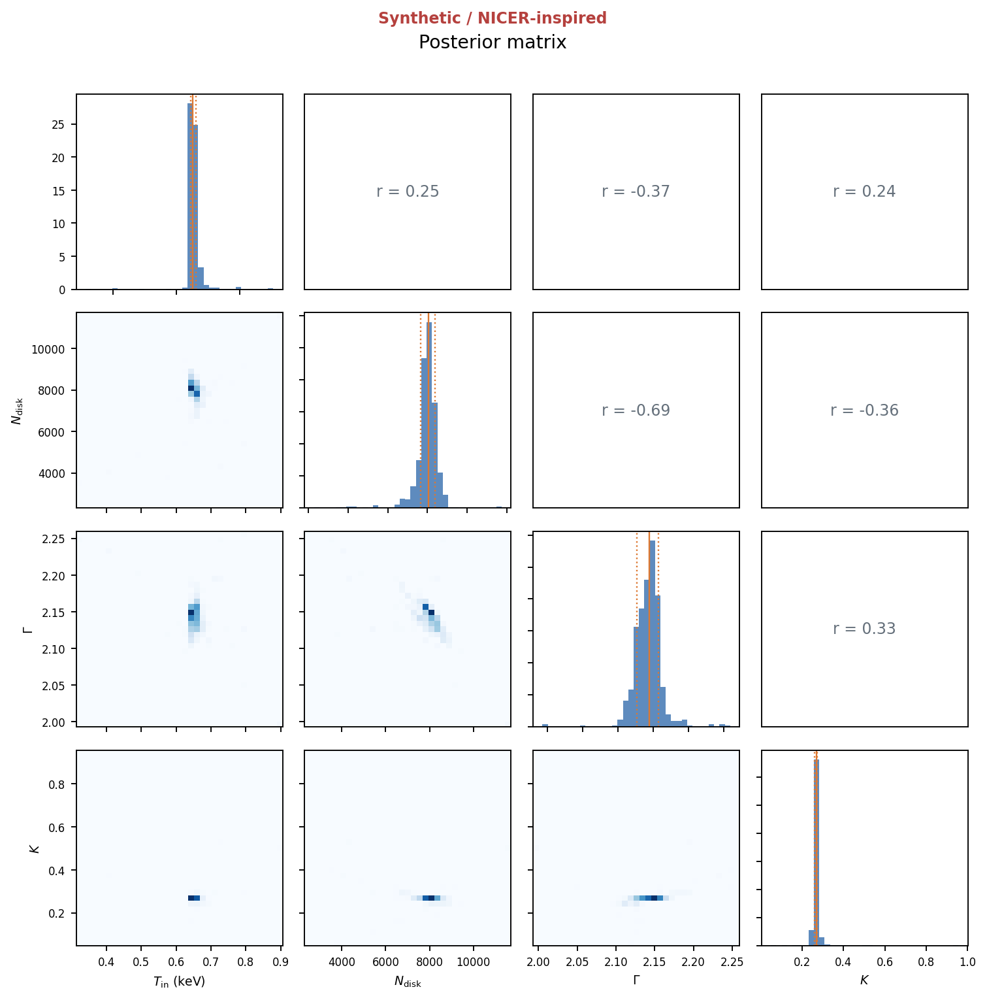
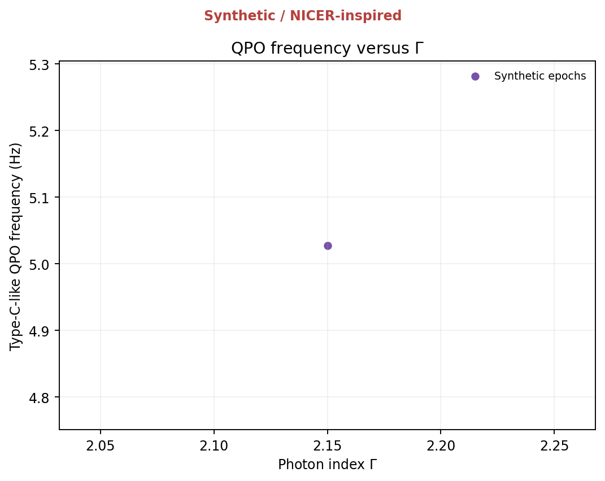
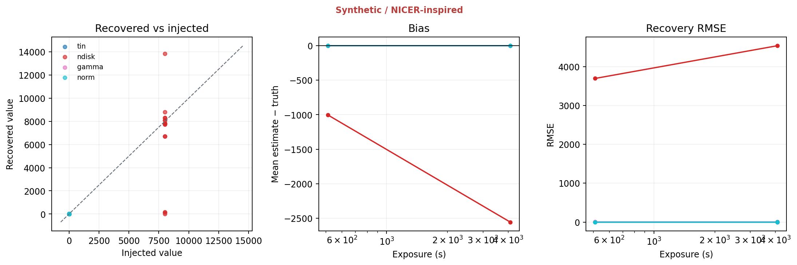
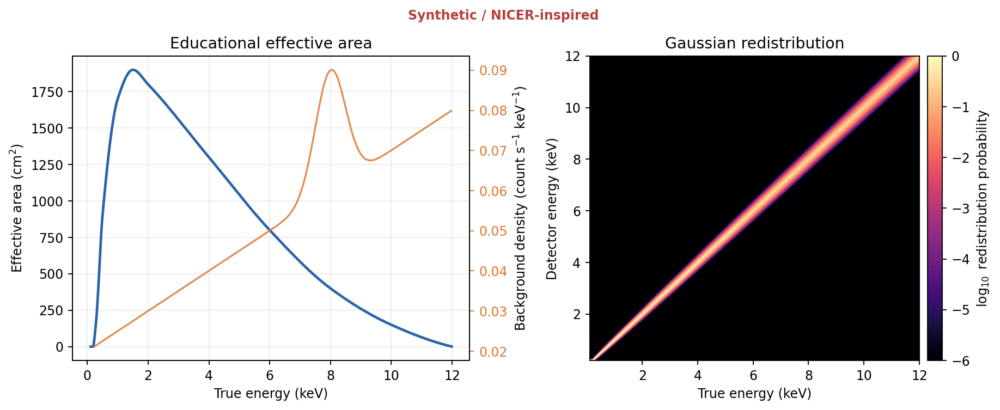

# EvoXRB: Pure-Python Synthetic Case Study

> **Synthetic / NICER-inspired.** This report contains no real NICER observations and
> makes no measurement of MAXI J1820+070. The spectral components, detector,
> background and timing signals are educational approximations with known
> injected truth.

## Run provenance

- Profile: `smoke`
- Configuration hash: `d17357d31d720259`
- Master seed: `1820070`
- Python: `3.14.2`
- Packages: PyYAML 6.0.3, dynesty 3.1.0, emcee 3.1.6, matplotlib 3.10.9, numpy 2.4.6, pandas 3.0.3, scipy 1.17.1
- Recorded end-to-end runtime: `2.814803600000232` seconds
- Artifact acceptance: **passed**
- Truth epochs generated: `12`
- Optimisation rows completed: `21`
- Recovery rows completed: `60`
- Posterior rows completed: `4`
- Timing rows completed: `3`

## Question and scope

The case study asks when a population-based global optimiser is useful for a
response-folded, Poisson X-ray fitting problem. A custom real-valued genetic
algorithm is compared with deterministic multi-start SciPy optimisation. The
best global solution seeds posterior inference; it is not itself treated as an
uncertainty distribution.

Expected detector counts are generated only after the photon model has been
multiplied by an effective-area curve and redistributed between detector
channels. The primary fit statistic is the Poisson C-statistic. A second,
cutoff continuum supplies a controlled model-misspecification experiment.

The phase names and reference dates are contextual anchors inspired by the
published evolution; they are not analyzed observations. See
[Li et al.](https://arxiv.org/html/2407.08421v2). The soft/hard timing-band
design is publication-inspired; see
[Stiele & Kong](https://arxiv.org/abs/1912.07625).

## Educational forward model

The photon model is explicitly approximate:

- absorption: `exp(-3 NH E^-3)`;
- disk-like component: `1e-4 Ndisk E^(-2/3) exp(-E/Tin)`;
- power law: `K E^(-Gamma)`;
- Comptonization cutoff surrogate: `K E^(-Gamma) exp(-E/20 keV)`.

These are **not** exact `TBabs`, `diskbb`, or `nthcomp` implementations. The
primary spectrum is absorption times (disk-like + power law); the controlled
alternative replaces the power law with the cutoff surrogate.

The response uses 600 true-energy bins over 0.1–12 keV, 236 detector channels
over 0.2–12 keV, and a 0.5–10 keV fit mask. Its effective area is a
shape-preserving interpolation through the declared NICER-inspired anchors.
Gaussian redistribution uses `FWHM(E)=0.085 sqrt(E)` keV and every response
column is normalized. Expected counts include the fixed synthetic background
and are computed as `exposure * R @ (area * flux * dE) + exposure * background`
before Poisson sampling.

## Optimization and inference design

The four normalized GA genes represent `Tin`, `log10(Ndisk)`, `Gamma`, and
`log10(K)`. The full profile uses 192 individuals, five independent seeds,
tournament size 3, 0.9 simulated-binary crossover, annealed bounded polynomial
mutation, 3% elitism, stagnation-triggered 5% immigrants, and at most 300
generations. Twenty deterministic Latin-hypercube SciPy starts form the
control. Raw GA, best SciPy, and GA-followed-by-local-polish rows remain
separate. A free-`NH` 0.01–1.0 sensitivity run is also retained separately.
The sub-unit high-signal `Delta C` acceptance check applies to the explicitly
defined GA-seeded local-polish stage; raw GA scores remain visible as a
basin-finding diagnostic rather than being silently replaced.

The GA solution seeds `emcee`. Linear parameters receive uniform priors and
normalizations/optional `NH` receive log-uniform priors through the normalized
gene transform. `dynesty` is triggered for competitive separated GA modes,
unconverged ensemble chains, or excessive posterior boundary mass.

## Injected outburst

**Synthetic / NICER-inspired table.**

| epoch_id | phase | reference_mjd | tin | ndisk | gamma | norm | qpo_hz |
| --- | --- | --- | --- | --- | --- | --- | --- |
| E01 | hard rise | 58193 | 0.2 | 15000 | 1.55 | 0.35 | 0.05 |
| E02 | hard plateau | 58210 | 0.24 | 14000 | 1.6 | 0.45 | 0.1 |
| E03 | hard plateau | 58235 | 0.28 | 13000 | 1.65 | 0.5 | 0.2 |
| E04 | hard plateau | 58259 | 0.32 | 12000 | 1.7 | 0.48 | 0.4 |
| E05 | hard decline | 58275 | 0.38 | 11000 | 1.68 | 0.4 | 0.8 |
| E06 | hard decline | 58289 | 0.45 | 10000 | 1.75 | 0.34 | 1.5 |
| E07 | intermediate | 58297 | 0.55 | 9000 | 1.95 | 0.32 | 3 |
| E08 | intermediate | 58302 | 0.65 | 8000 | 2.15 | 0.27 | 5 |
| E09 | intermediate | 58304 | 0.75 | 7000 | 2.35 | 0.2 | 8 |
| E10 | soft | 58330 | 0.7 | 7500 | 2.4 | 0.06 | nan |
| E11 | decay intermediate | 58390 | 0.45 | 9000 | 2 | 0.12 | 0.5 |
| E12 | return hard | 58403 | 0.3 | 11000 | 1.7 | 0.2 | 0.2 |

## Optimisation comparison

The lowest completed fixed-column primary-model C-statistic is **180.495** for `E08` using `ga+scipy` / `educational_powerlaw`.

**Synthetic / NICER-inspired table.**

| epoch_id | fit_model | method | stage | seed | statistic | delta_c | tin | ndisk | gamma | norm | wall_time_s |
| --- | --- | --- | --- | --- | --- | --- | --- | --- | --- | --- | --- |
| E01 | educational_cutoff_surrogate | ga | raw | 1.2342e+19 | 2842.8 | 2398 | 1.2451 | 0.409 | 1.47 | 0.3803 | 0.19323 |
| E01 | educational_cutoff_surrogate | ga+scipy | polished | 1.2342e+19 | 2756.2 | 2311.5 | 1.2472 | 0.41 | 1.4631 | 0.37632 | 0.20378 |
| E01 | educational_cutoff_surrogate | scipy | best_multistart | 5.0354e+18 | 444.76 | 0 | 0.37632 | 7608.6 | 1.3468 | 0.32692 | 0.25376 |
| E01 | educational_powerlaw | ga | raw | 1.5233e+19 | 698.57 | 490.61 | 1.015 | 0.43633 | 1.5819 | 0.36062 | 0.1898 |
| E01 | educational_powerlaw | ga+scipy | polished | 1.5233e+19 | 675.01 | 467.05 | 1.0148 | 0.4409 | 1.5816 | 0.36197 | 0.20052 |
| E01 | educational_powerlaw | scipy | best_multistart | 1.4669e+19 | 207.96 | 0 | 0.193 | 15342 | 1.5547 | 0.35176 | 0.28179 |
| E08 | educational_cutoff_surrogate | ga | raw | 6.0494e+18 | 1524.9 | 1270.7 | 0.65035 | 2647.3 | 2.2254 | 0.39799 | 0.19008 |
| E08 | educational_cutoff_surrogate | ga+scipy | polished | 6.0494e+18 | 254.19 | 1.1584e-08 | 0.59413 | 9959.7 | 1.9925 | 0.27212 | 0.23165 |
| E08 | educational_cutoff_surrogate | scipy | best_multistart | 3.9577e+18 | 254.19 | 0 | 0.59413 | 9959.7 | 1.9925 | 0.27212 | 0.30993 |
| E08 | educational_powerlaw | ga | raw | 6.1545e+17 | 4124.8 | 3944.3 | 0.43085 | 1489.2 | 2.3566 | 0.41671 | 0.18642 |
| E08 | educational_powerlaw | ga+scipy | polished | 6.1545e+17 | 180.49 | -8.4589e-09 | 0.64888 | 8060.9 | 2.1505 | 0.26938 | 0.22904 |
| E08 | educational_powerlaw | scipy | best_multistart | 1.7007e+19 | 180.49 | 0 | 0.64888 | 8060.9 | 2.1505 | 0.26938 | 0.2722 |
| E08 | educational_powerlaw_free_nh_sensitivity | ga | raw | 7.3304e+18 | 935.53 | 755.54 | 0.65185 | 12045 | 1.9169 | 0.17656 | 0.19027 |
| E08 | educational_powerlaw_free_nh_sensitivity | ga+scipy | polished | 7.3304e+18 | 179.99 | -5.6758e-08 | 0.65136 | 8160.3 | 2.1411 | 0.26518 | 0.24114 |
| E08 | educational_powerlaw_free_nh_sensitivity | scipy | best_multistart | 4.9288e+18 | 179.99 | 0 | 0.65136 | 8160.3 | 2.1411 | 0.26518 | 0.24172 |
| E10 | educational_cutoff_surrogate | ga | raw | 1.6992e+19 | 3972.5 | 3748.3 | 0.83112 | 2826.3 | 2.7295 | 0.15762 | 0.19649 |
| E10 | educational_cutoff_surrogate | ga+scipy | polished | 1.6992e+19 | 224.25 | 1.0729e-09 | 0.68988 | 7511.9 | 2.2981 | 0.066947 | 0.23548 |
| E10 | educational_cutoff_surrogate | scipy | best_multistart | 3.4745e+18 | 224.25 | 0 | 0.68988 | 7511.9 | 2.2981 | 0.066947 | 0.1738 |
| E10 | educational_powerlaw | ga | raw | 2.0056e+17 | 942.59 | 724.88 | 0.80411 | 5094.5 | 2.767 | 0.087907 | 0.18584 |
| E10 | educational_powerlaw | ga+scipy | polished | 2.0056e+17 | 217.71 | 2.1291e-08 | 0.70141 | 7383.5 | 2.4227 | 0.062163 | 0.20852 |
| E10 | educational_powerlaw | scipy | best_multistart | 8.0002e+18 | 217.71 | 0 | 0.70141 | 7383.5 | 2.4227 | 0.062162 | 0.29336 |

## Recovery and uncertainty

**Synthetic / NICER-inspired table.**

| scenario | exposure_s | realization | parameter | truth | estimate | error | delta_c |
| --- | --- | --- | --- | --- | --- | --- | --- |
| high_signal_correct | 4096 | 0 | tin | 0.7 | 0.6984 | -0.0016046 | 0 |
| high_signal_correct | 4096 | 0 | ndisk | 8000 | 8095.3 | 95.337 | 0 |
| high_signal_correct | 4096 | 0 | gamma | 2.1 | 2.0989 | -0.0011471 | 0 |
| high_signal_correct | 4096 | 0 | norm | 0.25 | 0.24903 | -0.0009686 | 0 |
| high_signal_correct | 4096 | 0 | tin | 0.7 | 0.99395 | 0.29395 | 11082 |
| high_signal_correct | 4096 | 0 | ndisk | 8000 | 142.68 | -7857.3 | 11082 |
| high_signal_correct | 4096 | 0 | gamma | 2.1 | 2.3463 | 0.24631 | 11082 |
| high_signal_correct | 4096 | 0 | norm | 0.25 | 0.42399 | 0.17399 | 11082 |
| high_signal_correct | 4096 | 0 | tin | 0.7 | 0.6984 | -0.0016046 | 1.1458e-07 |
| high_signal_correct | 4096 | 0 | ndisk | 8000 | 8095.3 | 95.348 | 1.1458e-07 |
| high_signal_correct | 4096 | 0 | gamma | 2.1 | 2.0989 | -0.001148 | 1.1458e-07 |
| high_signal_correct | 4096 | 0 | norm | 0.25 | 0.24903 | -0.00096895 | 1.1458e-07 |

### Aggregate recovery metrics

**Synthetic / NICER-inspired table.**

| scenario | exposure_s | method | stage | parameter | bias | rmse | failure_rate | boundary_hits | mean_delta_c | mean_evaluations | mean_runtime_s |
| --- | --- | --- | --- | --- | --- | --- | --- | --- | --- | --- | --- |
| correct_model | 512 | ga | raw | gamma | -0.036855 | 0.28243 | 1 | 0 | 2839.4 | 800 | 0.19971 |
| correct_model | 512 | ga | raw | ndisk | -3598.8 | 5685.1 | 1 | 0 | 2839.4 | 800 | 0.19971 |
| correct_model | 512 | ga | raw | norm | 0.011559 | 0.16456 | 1 | 0 | 2839.4 | 800 | 0.19971 |
| correct_model | 512 | ga | raw | tin | 0.41365 | 0.43708 | 1 | 0 | 2839.4 | 800 | 0.19971 |
| correct_model | 512 | ga+scipy | polished | gamma | -0.0022917 | 0.012899 | 0 | 0 | 1.269e-08 | 1090 | 0.25577 |
| correct_model | 512 | ga+scipy | polished | ndisk | 23.186 | 283.29 | 0 | 0 | 1.269e-08 | 1090 | 0.25577 |
| correct_model | 512 | ga+scipy | polished | norm | -0.0011974 | 0.0058205 | 0 | 0 | 1.269e-08 | 1090 | 0.25577 |
| correct_model | 512 | ga+scipy | polished | tin | 3.2049e-05 | 0.0020635 | 0 | 0 | 1.269e-08 | 1090 | 0.25577 |
| correct_model | 512 | scipy | best_multistart | gamma | -0.0022913 | 0.012899 | 0 | 0 | 0 | 1122.5 | 0.22236 |
| correct_model | 512 | scipy | best_multistart | ndisk | 23.181 | 283.29 | 0 | 0 | 0 | 1122.5 | 0.22236 |
| correct_model | 512 | scipy | best_multistart | norm | -0.0011971 | 0.0058205 | 0 | 0 | 0 | 1122.5 | 0.22236 |
| correct_model | 512 | scipy | best_multistart | tin | 3.1657e-05 | 0.0020633 | 0 | 0 | 0 | 1122.5 | 0.22236 |
| cutoff_truth_powerlaw_fit | 512 | ga | raw | gamma | -0.19711 | 0.57933 | 1 | 0 | 1809.9 | 800 | 0.26161 |
| cutoff_truth_powerlaw_fit | 512 | ga | raw | ndisk | -1006.1 | 6910.9 | 1 | 0 | 1809.9 | 800 | 0.26161 |
| cutoff_truth_powerlaw_fit | 512 | ga | raw | norm | -0.018109 | 0.18271 | 1 | 0 | 1809.9 | 800 | 0.26161 |
| cutoff_truth_powerlaw_fit | 512 | ga | raw | tin | 0.34964 | 0.44236 | 1 | 0 | 1809.9 | 800 | 0.26161 |
| cutoff_truth_powerlaw_fit | 512 | ga+scipy | polished | gamma | 0.13462 | 0.13737 | 0 | 0 | 1.2105e-09 | 1042.5 | 0.31037 |
| cutoff_truth_powerlaw_fit | 512 | ga+scipy | polished | ndisk | -734.14 | 921.57 | 0 | 0 | 1.2105e-09 | 1042.5 | 0.31037 |
| cutoff_truth_powerlaw_fit | 512 | ga+scipy | polished | norm | -0.014964 | 0.017429 | 0 | 0 | 1.2105e-09 | 1042.5 | 0.31037 |
| cutoff_truth_powerlaw_fit | 512 | ga+scipy | polished | tin | 0.058034 | 0.060189 | 0 | 0 | 1.2105e-09 | 1042.5 | 0.31037 |
| cutoff_truth_powerlaw_fit | 512 | scipy | best_multistart | gamma | 0.13462 | 0.13737 | 0 | 0 | 0 | 997.5 | 0.20061 |
| cutoff_truth_powerlaw_fit | 512 | scipy | best_multistart | ndisk | -734.14 | 921.56 | 0 | 0 | 0 | 997.5 | 0.20061 |
| cutoff_truth_powerlaw_fit | 512 | scipy | best_multistart | norm | -0.014964 | 0.017429 | 0 | 0 | 0 | 997.5 | 0.20061 |
| cutoff_truth_powerlaw_fit | 512 | scipy | best_multistart | tin | 0.058034 | 0.060189 | 0 | 0 | 0 | 997.5 | 0.20061 |
| high_signal_correct | 4096 | ga | raw | gamma | 0.24631 | 0.24631 | 1 | 0 | 11082 | 800 | 0.21068 |
| high_signal_correct | 4096 | ga | raw | ndisk | -7857.3 | 7857.3 | 1 | 0 | 11082 | 800 | 0.21068 |
| high_signal_correct | 4096 | ga | raw | norm | 0.17399 | 0.17399 | 1 | 0 | 11082 | 800 | 0.21068 |
| high_signal_correct | 4096 | ga | raw | tin | 0.29395 | 0.29395 | 1 | 0 | 11082 | 800 | 0.21068 |
| high_signal_correct | 4096 | ga+scipy | polished | gamma | -0.001148 | 0.001148 | 0 | 0 | 1.1458e-07 | 1125 | 0.27816 |
| high_signal_correct | 4096 | ga+scipy | polished | ndisk | 95.348 | 95.348 | 0 | 0 | 1.1458e-07 | 1125 | 0.27816 |

**Synthetic / NICER-inspired table.**

| epoch_id | fit_model | parameter | median | error_minus | error_plus | sampler | converged |
| --- | --- | --- | --- | --- | --- | --- | --- |
| E08 | educational_powerlaw | tin | 0.65193 | 0.0058999 | 0.009827 | emcee | True |
| E08 | educational_powerlaw | ndisk | 8035.8 | 367.12 | 341.19 | emcee | True |
| E08 | educational_powerlaw | gamma | 2.1444 | 0.017208 | 0.013061 | emcee | True |
| E08 | educational_powerlaw | norm | 0.26813 | 0.008588 | 0.005018 | emcee | True |

## Synthetic timing

The timing series use 0.5–2 and 2–10 keV-inspired bands. Detections are labelled
only as **type-C-like**, because the signals were injected into synthetic light
curves rather than classified from telescope data. Full runs use 1/512-s bins,
512-s segments, Timmer–Koenig red noise, Lorentzian QPOs, averaged periodograms,
SciPy Lorentzian fits, and 200 bootstrap realizations. Acceptance requires
`Q >= 2` and QPO amplitude/error `>= 3`.

**Synthetic / NICER-inspired table.**

| epoch_id | phase | hardness_ratio | intensity_cps | qpo_injected_hz | qpo_centroid_hz | q_factor | significance | classification |
| --- | --- | --- | --- | --- | --- | --- | --- | --- |
| E01 | hard rise | 2.4429 | 1399.5 | 0.05 | 0.02242 | 0.60637 | 3.1178 | nan |
| E08 | intermediate | 1.4373 | 2751.1 | 5 | 5.0277 | 8.2732 | 23.582 | type-C-like |
| E10 | soft | 1.1741 | 2701.8 | nan | nan | nan | 0 | nan |

## Figures

## Interpretation boundary

Successful recovery demonstrates that the optimiser and inference machinery
work for this declared synthetic forward model. Failure under the cutoff-truth
/ power-law-fit experiment demonstrates model misspecification: a numerically
excellent optimum does not make an approximate model physically correct.

The smoke profile proves integration and reproducibility with reduced numerical
budgets. Scientific acceptance of the stated campaign metrics belongs to the
opt-in `full` profile; smoke-run precision is not presented as a replacement.
